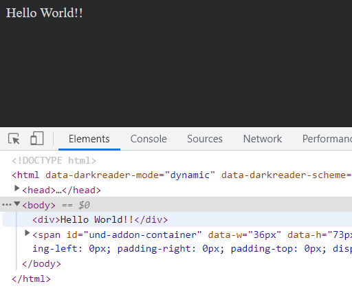

# goog.declareModuleId
Associates an ES or CommonJS module with a Closure module ID so that is available via `goog.require`.  

To build and run this app with NPM CLI:  
```sh
npm install
npm run build
npm run start
```

If all goes well, you will see this message in your browser:  

