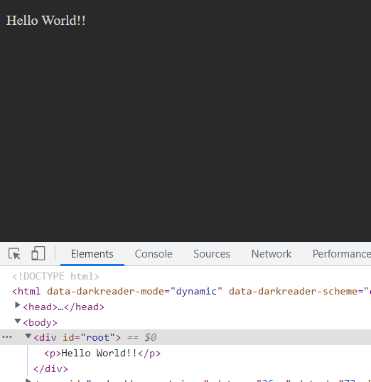

# react
Convert Closure library to ES modules and use it with `react`.  
* 🍄The `scripts/gen.js` shows how convert Closure library to ES modules.  
  Why not direct use the Closre library in react project maybe you will ask. This plugin internal use the Webpack `JavascriptParser` that not support the JSX file, convert Closure library to ES modules is just a makeshift fix and experiment, this may change in next version, but before that i must find a more powerfull JS/JSX parser, maybe the esbuild or something written in go or rust, i really need some advice!!  
  **!!Important!!** As i say its a experiment and the transformed Closure library less test, you must be very careful!!  
  When import the Closure modules, there two ruels must abide:  
  1. Must import goog first!!  
  2. Import other Closure modules only for side effects!!  
  ```import '../closure/closure/goog/string/string';```
* 🍄The `PatchBasefilePugin` in `webpack.config` shows how remove all `ConstDependency` of toplevel this in base.js presentational dependencies.  
  Why and how remove it, see the source at https://github.com/funte/google-closure-library-webpack-plugin/blob/92613e/src/Plugin.ts#L111  

To build and run this app with CLI:  
```sh
yarn install
# See help.
yarn run help
# Convert Closure library to ES modules.
yarn gen
yarn build
yarn start
```

If all goes well, you will see this message in your browser:  

