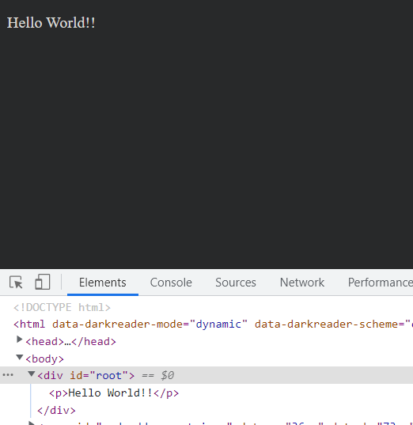

# exprements.typescript
Convert Closure library to ES modules and use it in `typescript` with Webpack5(Not support `tsc`, the transformed ES modules seems has many grammar issues in `typescript`).  

To build and run this app with CLI:  
```sh
yarn install
# See help.
yarn run help
# Convert Closure library to ES modules.
yarn gen
yarn build
yarn start
```

If all goes well, you will see this message in your browser:  

