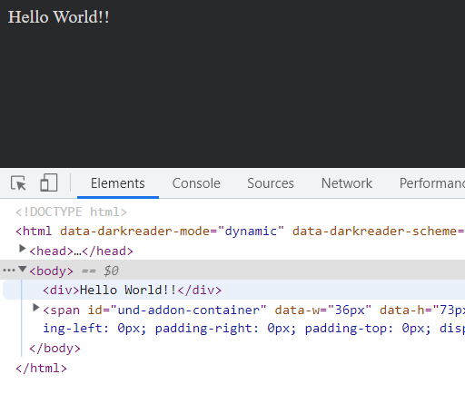

# goog.module.declareLegacyNamespace
`goog.module.declareLegacyNamespace` example, allow you require a leagcy GOOG module in PROVIDE module.

To build and run this app with NPM CLI:  
```sh
npm install
npm run build
npm run start
```

If all goes well, you will see this message in your browser:  

