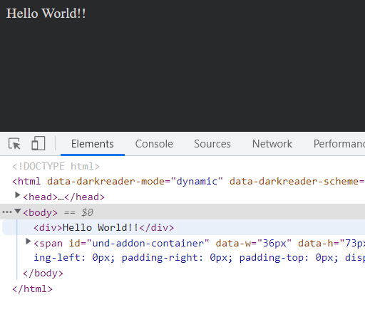

# goog.provide
`goog.provide` example.  
!!`goog.provide` has deprecated, please use `goog.module`.  

To build and run this app with NPM CLI:  
```sh
yarn install
yarn build
yarn start
```

If all goes well, you will see this message in your browser:  

