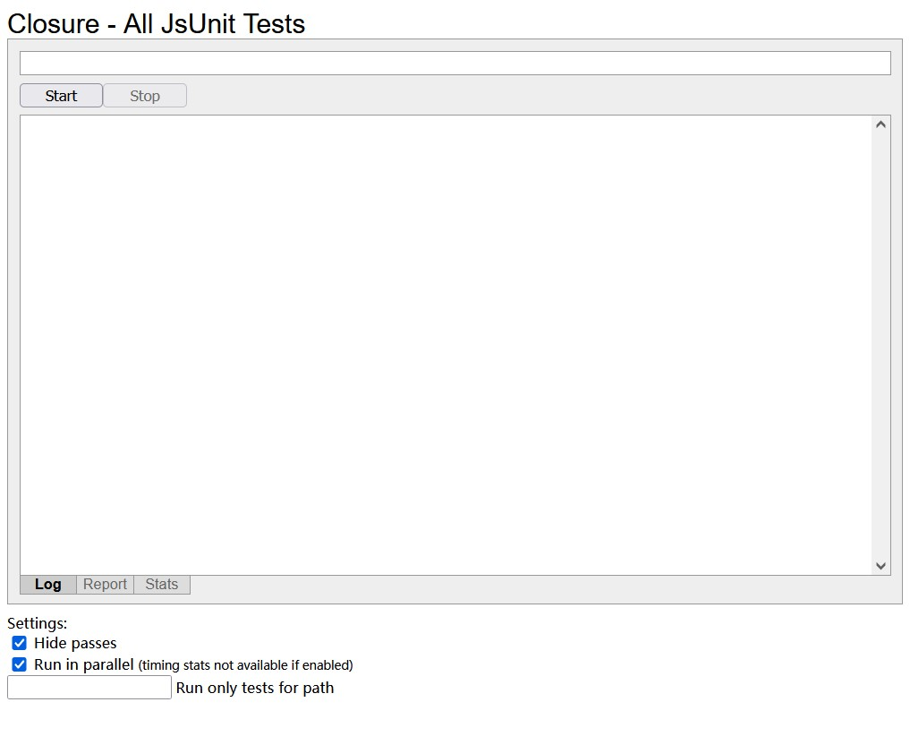
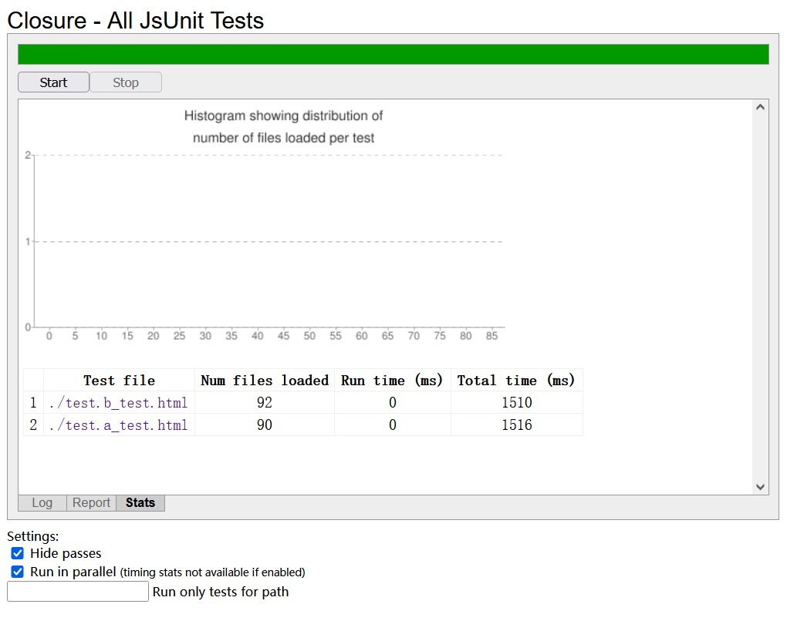
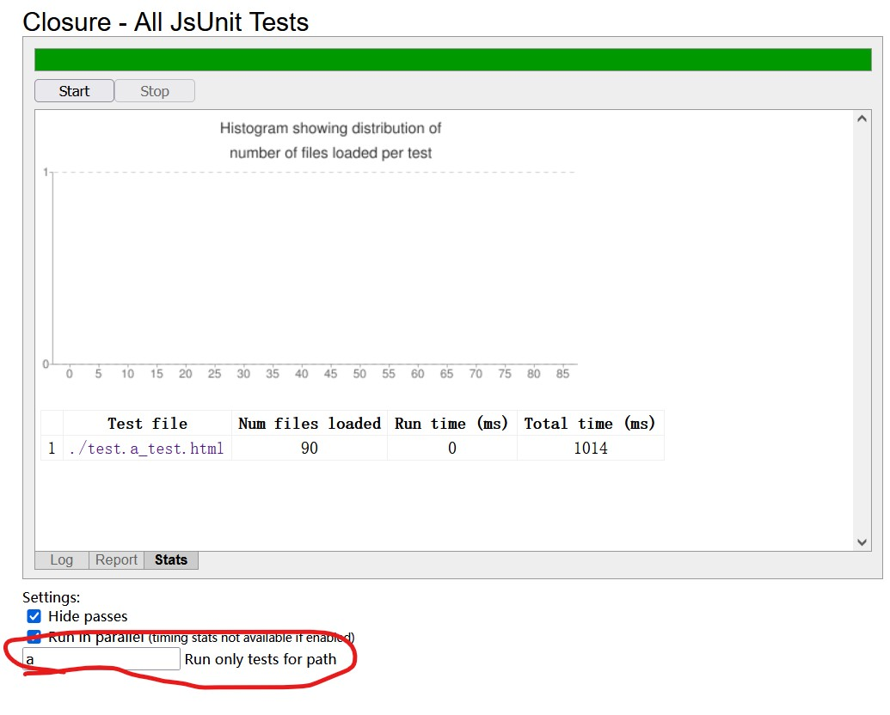

# test
Using `goog.addDependency` load and execute JsUnit test in an unbundled, uncompiled browser environment.  
The `scripts/gen.js` show how generate the JsUnit test HTML file.  

To run this app with NPM CLI:  
```sh
npm install
# See help.
npm run help
# Generate HTML unit test files and runner.
npm run gen
# Open the runner in browser.
npm run test
```

If all goes well, you will see this in your browser.   


Click the `Start` button to start all tests.  


Also you can use the filter start a single test.  

